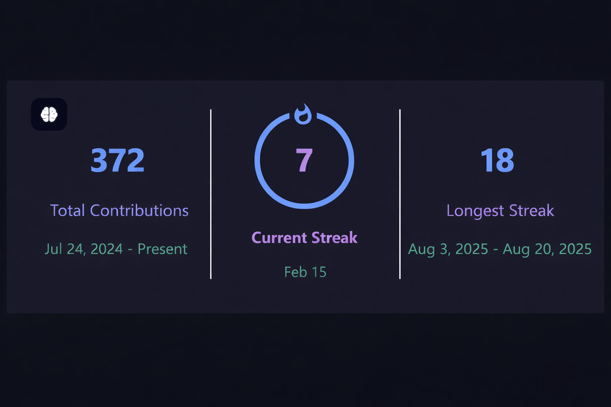

# 💫 Hi 👋, I'm Tirth Patel
**A passionate AI & Full Stack Developer || Competitive Programmer (DSA) from India 🇮🇳**

📧 Email Me 👉 ✉️ **pateltirth27122005@gmail.com**  
For collaboration, projects, or tech discussions 😊

- 🔭 **I’m currently working on:** AI-based projects & full-stack applications  
- 🌱 **I’m currently learning:** Advanced DSA, System Design, Machine Learning  
- 👯 **I’m looking to collaborate on:** Real-world ML or full-stack projects  
- 🤔 **I’m looking for help with:** Scaling applications & ML deployment  
- 💬 **Ask me about:** DSA, ML basics, React, Next.js, Node.js  
- 📫 **How to reach me:** pateltirth27122005@gmail.com  
- 😄 **Pronouns:** He/Him  
- ⚡ **Fun fact:** I prefer consistency over motivation 😄  

---

## 🔗 Connect with me

---

<!-- Snake Game Repo View -->

  

---

<!-- ## 🏆 GitHub Trophies

  

 -->

---

## 💻 Tech Stack

**Languages**

**Frameworks & Tools**

**Databases**

---
## 📊 GitHub Stats

  

---

### ✍️ Random Dev Quote

  

---

  <i>“Consistency beats talent when talent isn’t consistent.”</i>

